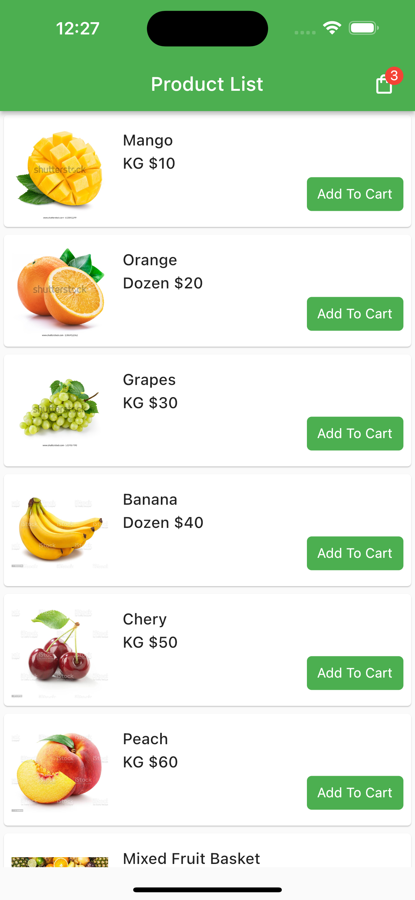
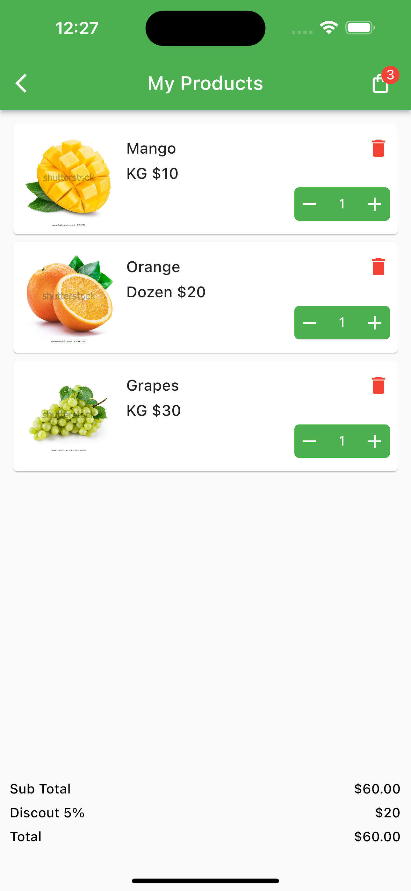
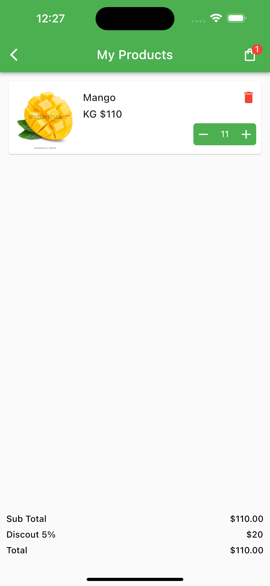
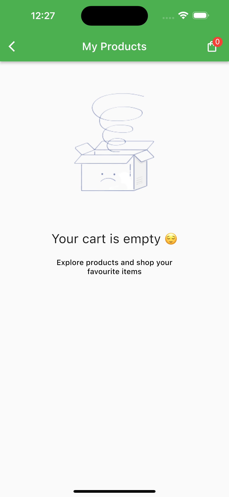

# Shopping Cart Flutter

A new Flutter shopping cart project.

## Home Screen

## Cart Screen

## Adding / Removing products from cart

## When cart is empty

- This is a simple flutter project with two screen. One is the product list screen and the other is cart screen.
- Simple screen is used to show the available products to the user and user can select product from there to the cart.

